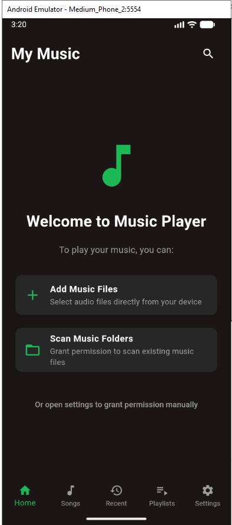
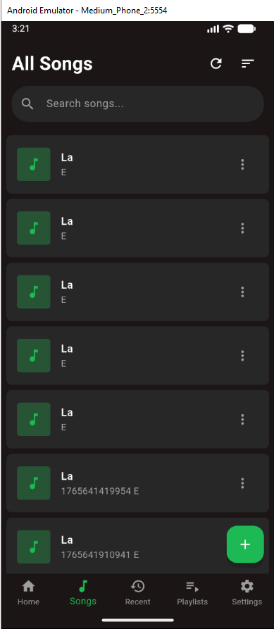
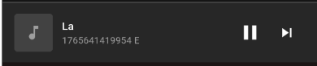
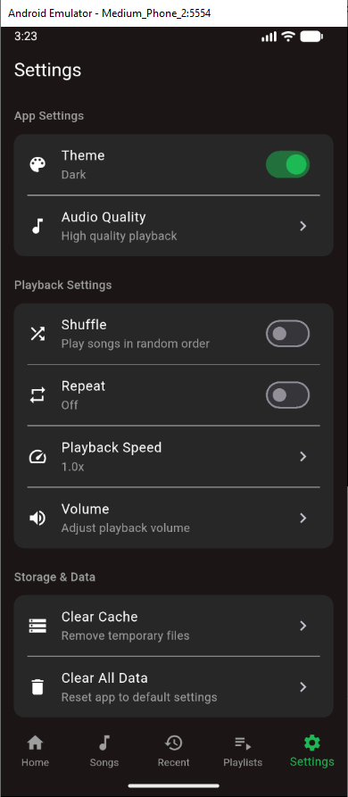

# 🎵 Flutter Music Player

Một ứng dụng nghe nhạc offline đầy đủ tính năng được xây dựng bằng Flutter, cho phép bạn quản lý và phát nhạc từ thiết bị của mình.

## ✨ Tính Năng Chính

- **🎼 Quản lý thư viện nhạc**: Tự động quét và hiển thị tất cả bài hát trên thiết bị
- **🎧 Phát nhạc mượt mà**: Hỗ trợ các định dạng MP3, M4A, FLAC, WAV, OGG
- **🔄 Điều khiển phát nhạc**: Phát/Tạm dừng, Chuyển bài, Tua, Chế độ lặp (Tắt/Lặp danh sách/Lặp một bài)
- **🔀 Chế độ ngẫu nhiên**: Phát ngẫu nhiên toàn bộ thư viện nhạc
- **📱 Giao diện hiện đại**: Thiết kế theo phong cách Spotify với chế độ sáng/tối
- **🔍 Tìm kiếm thông minh**: Tìm kiếm bài hát theo tên, ca sĩ, album
- **🎵 Tạo playlist**: Tạo và quản lý playlist cá nhân
- **📊 Thông tin bài hát**: Hiển thị đầy đủ metadata (nghệ sĩ, album, thời lượng)
- **🎮 Mini Player**: Điều khiển phát nhạc từ mọi màn hình
- **⚙️ Cài đặt linh hoạt**: Tuỳ chỉnh chất lượng âm thanh, chế độ lặp, giao diện

## 🚀 Cách Cài Đặt

### Yêu cầu hệ thống
- Flutter SDK 3.0.0 hoặc cao hơn
- Android 5.0+ / iOS 11.0+ hoặc cao hơn
- Quyền truy cập bộ nhớ (để đọc file nhạc)

### Các bước cài đặt

1. **Clone repository**
   ```bash
   git clone https://github.com/Kiet1122/flutter_music_player_NguyenTatKiet.git
   cd offline_music_player
   ```

2. **Cài đặt dependencies**
   ```bash
   flutter pub get
   ```

3. **Chạy ứng dụng**
   ```bash
   flutter run
   ```

## 📱 Hình ảnh màn hình

### Màn hình chính 


### Danh sách nhạc


### Mini Player


### Quản lý Playlist


### Màn hình tìm kiếm


### Màn hình cài đặt


## 🎵 Cách thêm file nhạc để test

### Trên Android:
1. **Thêm file nhạc vào thư mục Download**
   - Kết nối điện thoại với máy tính
   - Copy file nhạc vào thư mục `Download` hoặc `Music`
   - Ứng dụng sẽ tự động quét và hiển thị

2. **Sử dụng file picker trong ứng dụng**
   - Mở ứng dụng Flutter Music Player
   - Nhấn nút "+" trên màn hình chính
   - Chọn file nhạc từ bộ nhớ thiết bị

### File mẫu được cung cấp:
- `sample_song_1.mp3` - Nhạc cụ dạo đầu (1:30)
- `sample_song_2.mp3` - Giai điệu piano (2:15)
- `sample_song_3.mp3` - Âm thanh ambient (3:45)

## 🛠 Công nghệ sử dụng

### Core Framework
- **Flutter 3.0+** - UI framework đa nền tảng
- **Dart 2.17+** - Ngôn ngữ lập trình

### Audio Playback
- **just_audio** - Engine phát nhạc mạnh mẽ
- **audio_service** - Hỗ trợ phát nhạc nền và notification
- **media_info** - Trích xuất metadata từ file audio

### State Management
- **Provider** - Quản lý state đơn giản và hiệu quả
- **RxDart** - Xử lý stream và reactive programming

### Storage & Persistence
- **shared_preferences** - Lưu cài đặt và trạng thái
- **path_provider** - Truy cập thư mục hệ thống
- **file_picker** - Chọn file từ bộ nhớ

### UI & Design
- **Material Design 3** - Component UI hiện đại
- **palette_generator** - Trích xuất màu từ ảnh bìa
- **flutter_icons** - Icon set đa dạng

### Permissions
- **permission_handler** - Quản lý quyền truy cập

### Testing
- **flutter_test** - Unit và widget testing
- **mockito** - Tạo mock objects cho testing

## ⚠️ Hạn chế đã biết

1. **Hiệu suất với thư viện lớn**
   - Ứng dụng có thể chậm khi xử lý trên 5000 bài hát
   - Quá trình quét file ban đầu có thể mất thời gian

2. **Hỗ trợ metadata**
   - Một số metadata (ảnh bìa, lời bài hát) có thể không được đọc từ tất cả định dạng file
   - ID3 tags từ các phiên bản cũ có thể không tương thích hoàn toàn

3. **Định dạng file**
   - Một số định dạng âm thanh hiếm có thể không được hỗ trợ
   - File DRM-protected không thể phát được

4. **Quyền hệ thống**
   - Trên iOS, chỉ có thể truy cập file trong sandbox của ứng dụng
   - Cần cấp quyền thủ công cho một số thư mục trên Android 11+

5. **Phát nhạc nền**
   - Trên một số thiết bị Android, phát nhạc nền có thể bị gián đoạn bởi chế độ tiết kiệm pin

6. **Tương thích thiết bị**
   - Một số tính năng có thể hoạt động khác nhau giữa các phiên bản Android/iOS

## 🚀 Cải tiến trong tương lai

### Ngắn hạn (Phiên bản tiếp theo)
- [ ] Thêm hỗ trợ streaming từ URL
- [ ] Tích hợp lời bài hát (Lyrics display)
- [ ] Thống kê nghe nhạc (Most played, recently added)
- [ ] Chế độ Sleep Timer
- [ ] Equalizer cơ bản

### Trung hạn (3-6 tháng)
- [ ] Đồng bộ hoá playlist qua cloud
- [ ] Chia sẻ playlist với người dùng khác
- [ ] Podcast support với chapter marks
- [ ] Tích hợp với Last.fm scrobbling
- [ ] Chế độ Car Mode với giao diện tối giản

### Dài hạn (6-12 tháng)
- [ ] Hỗ trợ casting (Chromecast, AirPlay)
- [ ] AI-powered recommendations
- [ ] Cross-device sync (nghe tiếp trên thiết bị khác)
- [ ] Hỗ trợ định dạng lossless cao cấp (DSD, MQA)
- [ ] Plugin system cho audio effects

### Cải tiến kỹ thuật
- [ ] Chuyển sang Riverpod cho state management
- [ ] Tích phân tích crash reporting (Sentry/Firebase Crashlytics)
- [ ] CI/CD pipeline tự động hoá
- [ ] Internationalization (đa ngôn ngữ)
- [ ] Accessibility improvements (hỗ trợ người khuyết tật)
